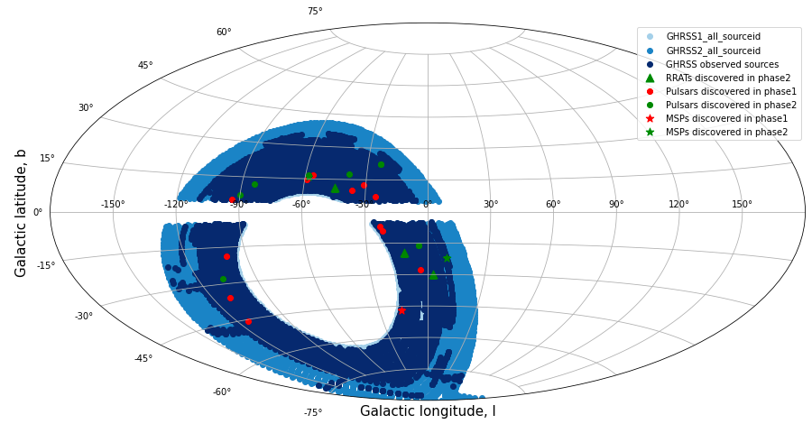

# The GHRSS Survey

This is the code repository for the [**G**MRT **H**igh **R**esolution
**S**outhern **S**ky (**GHRSS**)][ghrss] survey, being undetaken at the
[**G**iant **M**eterwave **R**adio **T**elescope (**GMRT**)][gmrt]. The
**GHRSS** survey has discovered **25** new pulsars (out of which **3** are
millisecond pulsars, or MSPs) and **4** new RRATs till date. A thorough overview
of the survey patameters and design can be found [**here**][paper1], and
additional results can be found [**here**][paper2]. The paper introducing the
new FFA-based pulsar search pipeline and it's new discoveries can be found
[**here**][paper3].

## Discoveries

|   Name         |     Type         |    Period (ms)     |    DM (pc/cc)     |    Flux density(mJy) |
|----------------|------------------|--------------------|-------------------|----------------------|
|   J0418-4154   |     PSR          |    757.11          |    24.5           |    10.3              |
|   J0514-4407   |     PSR          |    320.7           |    15.4           |    9.7               |
|   J0600-46     |     PSR          |    798.8           |    50.36          |    10                |
|   J0702-4956   |     PSR          |    666.66          |    98.7           |    15.7              |
|   J0919-42     |     PSR          |    812.6           |    57 	         |    6.4               | 
|   J0941-43     |     PSR          |    447.7           |    105.5          |    2.3               |
|   J1023-43     |     PSR          |    454.3           |    62.7           |    1.6               |
|   J1239-48     |     PSR          |    653.89          |    107.6          |    0.4               |
|   J1242-46     |     PSR          |    1411.3          |    76.5           |    12                |
|   J1243-47     |     MSP          |    5.31            |    78.6           |    0.9               |
|   J1245-52     |     PSR          |    835.39          |    86.3           |    1                 |
|   J1255-46     | mildly recycled  |    52.0            |    42.9           |    0.8               |
|   J1406-50     |     RRAT         |    -               |    40 	         |    -                 |
|   J1428-42     |     PSR          |    234.7           |    66.0           |    1.8               |
|   J1447-50     |     PSR          |    960.2           |    107.8          |    0.7               |
|   J1456-48     |     PSR          |    536.81          |    133.0          |    1.2               |
|   J1516-43     | mildly recycled 	|    36.02 	         |    70.25          |    0.7               |
|   J1517-31     |     PSR          |    1103.7          |    61.7           |    0.32              |
|   J1517-31     |     PSR          |    140.67          |    51.0           |    0.7               |
|   J1559-44     |     PSR          |    1169.89         |    122.0 	     |    1.7               |
|   J1708-52     |     PSR          |    449.62          |    102.6          |    1.4               |
|   J1726-52     |     PSR          |    631.84          |    119.7          |    0.7               |
|   J1810-42     |     PSR          |    532.20          |    104.9          |    1.5               |
|   J1845-40     |     PSR          |    324.18          |    68.4           |    -                 |
|   J1845-40     |     RRAT         |    373.48 	     |    47.8           |    -                 |
|   J1850-48     |     RRAT         |    -               |    23 	         |    -                 |    
|   J1936-30     |     PSR          |    1.6758          |    42.3           |    0.8               |
|   J1947-43     |     PSR          |    180.94          |    29.9           |    4.7               |
|   J2004-38     |     RRAT         |    -               |    23 	         |    -                 |
|   J2059-48     |     MSP          |    9.48            |    25.04          |    -                 |
|   J2144-5237   |     MSP          |    5.04            |    19.0           |    1.6               |

## Sky Coverage

  

  

**GHRSS survey sky coverage and discoveries**: Part of the target sky that has
already been covered by the survey is marked as a deep blue shaded region. Part
of the sky that has not yet been covered by the survey is marked as a light blue
shaded region. **Image Credit** : [***Shreya Prabhu (NIUS student)***][shreya].

[shreya]: https://github.com/shreyaprabhu19

[gmrt]: http://gmrt.ncra.tifr.res.in
[paper2]: https://doi.org/10.3847/1538-4357/ab2bf3
[paper3]: https://doi.org/10.3847/1538-4357/ac7b91
[paper1]: https://doi.org/10.3847/0004-637X/817/2/130
[ghrss]: http://www.ncra.tifr.res.in/~bhaswati/GHRSS.html
